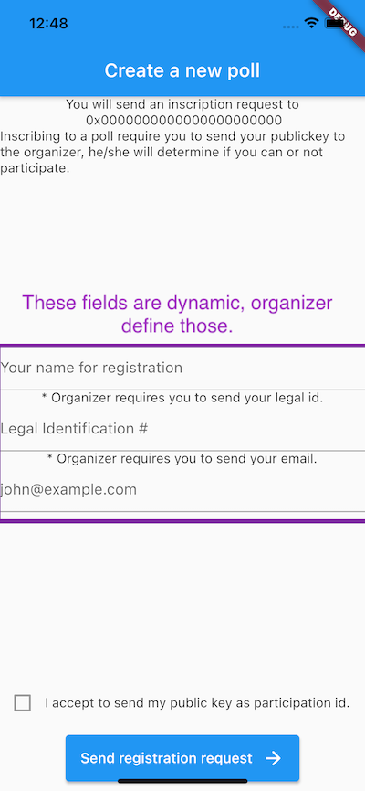

It's a decentralized, blockchain-based voting poll system. It allows creation and participation on a blockchain-based voting dapp. Secure and trust matter in a **democracy**. Support a voting poll using your ether, organizer pays the voting fee (ether gas fee). *[Fully-definition in progress]*

## How it works? 

It uses Ether to support the poll, the voters will pay the tx fee from this poll support. It means that the votes tx are paid by the poll organizer. It splits the poll-support into the required valid to vote (VTV) addresses. It keeps control of the poll on the organizer side. It uses Ethereum smart contracts as the engine. The polls will expire, at that point, the non-used tx token support will be returned to the organized. 

This is an initial approach project. Looking for a POC in an initial state. If the POC is completed successfully and works as expected, the dapp will be released over an MIT license. Feel free to contribute via @GitHub.

Join the discussion group in Telegram https://t.me/joinchat/e5ZMKKUTOL45ZWIx

## App Architecture

### Scenes

#### Poll Registration

This scene allow a you to register to a poll. It will require some information required by the organized and will share you publickey to the organizer. He/she can allow or deny your participation. The poll has a **public key** and a **public address** that will allow your to find the poll . Poll creator could distribute the address via multiple services (mail, sms, phone, secure notes, etc...).

Open questions: 

- Who pays the fee for the registation request?
- How use a better identifier in a visual way?

#### Poll Creation

[TBD]

### Dependencies

The application is built on *Flutter*, it uses *web3dart* package as Web3 provider. Flutter project enables desktop native flavors for corporate/government use cases. It requires Dart and Flutter.

- https://flutter.dev
- https://github.com/simolus3/web3dart

#### Development Tools

- https://github.com/trufflesuite/ganache
- https://www.trufflesuite.com/truffle

### Instalation

[TBD]

### Development

[TBD]

## Credits

- Mateo Olaya (founder, developer)
  Telegram channel https://t.me/joinchat/rVDgJa6iWA5hMTcx

  eth: [0xB14692dfCB874dE4f90733Cd76B994B298AC840B](https://www.etherchain.org/account/0xB14692dfCB874dE4f90733Cd76B994B298AC840B)

